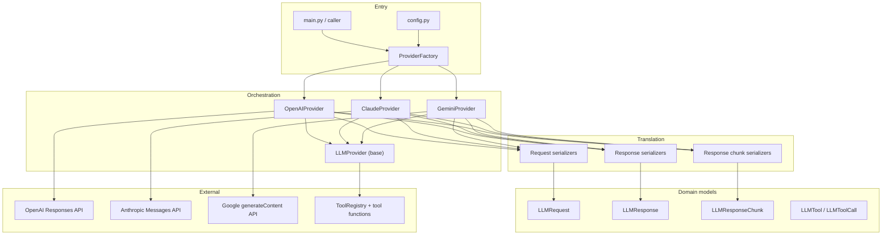
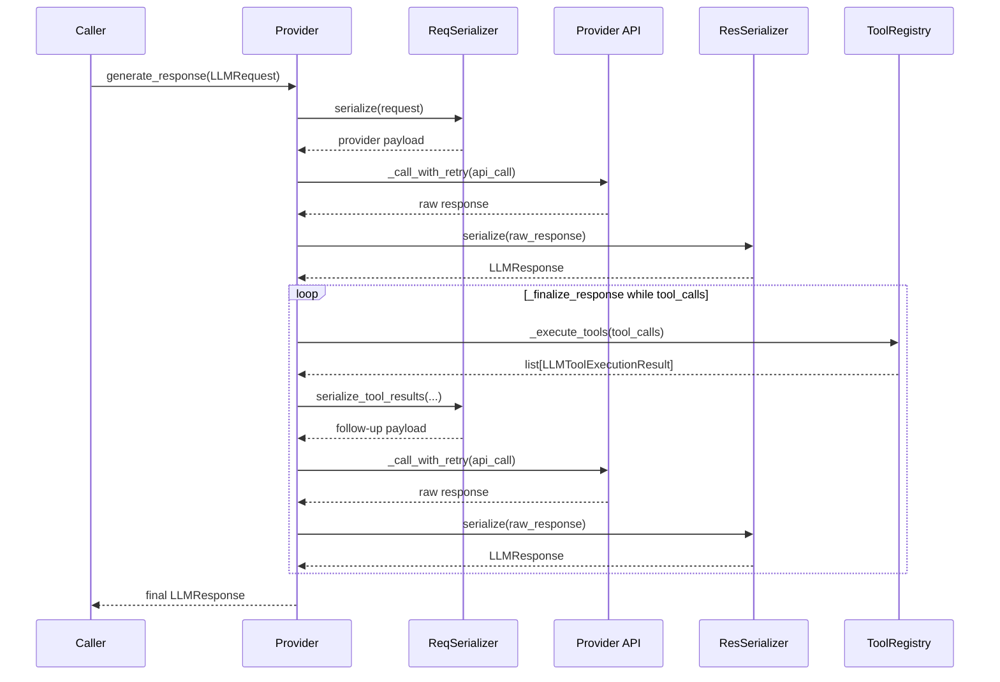
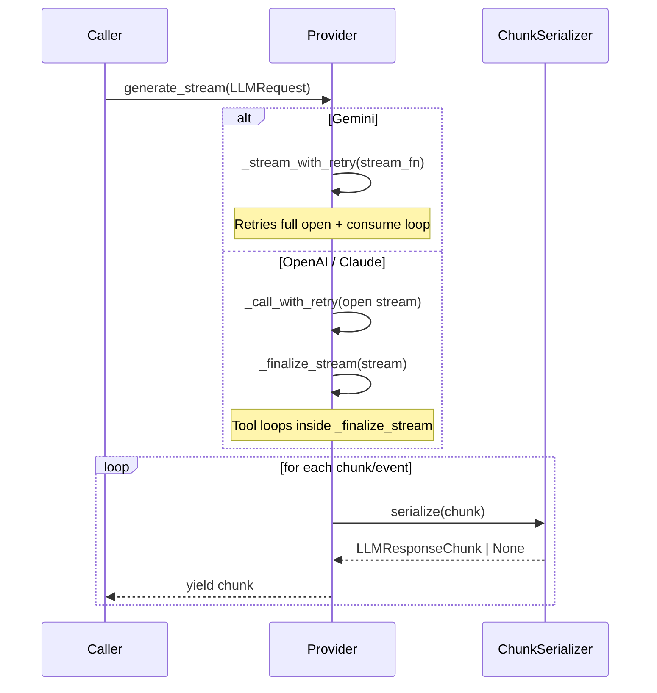
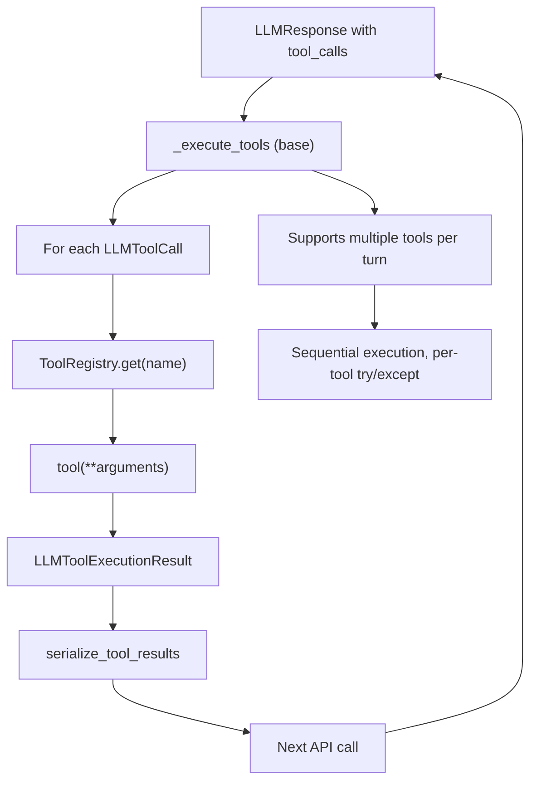

# LLM SDK Architecture

A provider-agnostic Python SDK for calling OpenAI, Claude, and Gemini through a single internal interface. The design separates **orchestration** (providers), **translation** (serializers), and **domain models** so each layer has one job.

---

## Design principles

1. **Provider owns orchestration** — The provider coordinates the full request lifecycle: serialization, API calls, streaming, tool-calling loops, retries, and response handling.
2. **Serializers are stateless** — They translate between internal models (`LLMRequest`, `LLMResponse`) and provider-specific API payloads. They do not call APIs or execute tools.
3. **One internal interface** — Callers build an `LLMRequest` and receive `LLMResponse` / `LLMResponseChunk` regardless of provider.
4. **Shared tool execution** — Tool functions live in `tool_functions/` and are invoked by the base `LLMProvider._execute_tools()`.

---

## High-level layers



---

## Directory structure

```
01-LLM-SDK/
├── config.py                 # API keys, models, provider selection, retry settings
├── main.py                   # Manual validation entry point
├── architecture.md           # This document
│
├── enums/                    # ProviderType, MessageRole, GeminiThinkingLevel
├── factories/
│   └── provider_factory.py   # Creates provider from LLM_PROVIDER config
│
├── models/                   # Internal Pydantic models (provider-agnostic)
│   ├── llm_request.py
│   ├── llm_response.py
│   ├── llm_response_chunk.py
│   ├── llm_message.py
│   ├── llm_usage.py
│   └── tools/                # LLMTool, LLMToolCall, LLMToolExecutionResult
│
├── providers/                # Orchestration — one class per provider
│   ├── llm_provider.py       # Abstract base + shared tool execution + retry
│   ├── openai_provider.py
│   ├── claude_provider.py
│   └── gemini_provider.py
│
├── serializers/              # Stateless request/response translation
│   ├── base_request_serializer.py
│   ├── base_response_serializer.py
│   ├── base_response_chunk_serializer.py
│   ├── openai_*.py
│   ├── claude_*.py
│   └── gemini_*.py
│
├── tool_functions/           # Callable tools + ToolRegistry
├── services/                 # Backing services used by tools (weather, currency)
└── runtime_logs/             # Application logs
```

---

## Request lifecycle (non-streaming)



---

## Request lifecycle (streaming)



---

## Internal domain models

| Model | Purpose |
|-------|---------|
| `LLMRequest` | `messages`, `temperature`, `max_tokens`, `tools` |
| `LLMMessage` | `role`, `content`, optional `tool_calls` |
| `LLMResponse` | Normalized completion: `text`, `tool_calls`, `usage`, `raw_response` |
| `LLMResponseChunk` | Streaming unit: `text`, `tool_call`, `is_finished` |
| `LLMTool` | Tool declaration (name, description, parameters) |
| `LLMToolCall` | Model-requested invocation: `call_id`, `name`, `arguments` |
| `LLMToolExecutionResult` | Tool output: `tool_call`, `result` or `error` |

Callers and providers never depend on OpenAI/Anthropic/Google SDK types except inside serializers and `raw_response`.

---

## Provider comparison

Each provider implements `generate_response()` and `generate_stream()`. Tool follow-up strategy differs by API design.

| Concern | OpenAI | Claude | Gemini |
|---------|--------|--------|--------|
| **API** | Responses API | Messages API | `generateContent` |
| **Conversation state** | `previous_response_id` | Full message history rebuild | Full `contents` rebuild |
| **Tool follow-up** | `serialize_tool_results(previous_response_id=...)` | Append assistant blocks + tool results to messages | Append raw model `Content` + `FunctionResponse` parts |
| **Streaming + tools** | `_finalize_stream` | `_finalize_stream` | Not yet implemented |
| **Tool calling (non-streaming)** | `_finalize_response` | `_finalize_response` | Planned (Milestone 3) |
| **Model fallback on retry** | No | No | Yes (`GEMINI_FALLBACK_MODEL`) |

### OpenAI — stateful via response ID

OpenAI uses the Responses API. After the first turn, tool follow-ups send only `previous_response_id` plus tool outputs — not the full chat history.

### Claude — stateless history rebuild

Claude requires the full conversation rebuilt on every call. Tool follow-ups append the assistant content blocks (including `tool_use`) and user `tool_result` blocks.

### Gemini — stateless `contents` rebuild

Gemini mirrors Claude's pattern using `contents` / `parts`:

- Initial request: user messages → `types.Content`
- Tool turn: append raw `response.candidates[0].content` (preserves `thought_signature`)
- Tool result: append `role="user"` content with `Part(function_response=FunctionResponse(..., id=call_id))`
- Manual tool loop: `automatic_function_calling` disabled

---

## Serializers

Serializers are **stateless translators**. Each provider has three serializers:

| Serializer | Direction |
|------------|-----------|
| `*RequestSerializer` | `LLMRequest` → provider API payload |
| `*ResponseSerializer` | Provider response → `LLMResponse` |
| `*ResponseChunkSerializer` | Provider stream event/chunk → `LLMResponseChunk` |

### Request serializers

- **`serialize(request)`** — Initial call payload.
- **`serialize_tool_results(...)`** — Follow-up payload after tools run (OpenAI, Claude; Gemini planned).

Provider-specific details stay inside serializers (role mapping, tool declaration format, token field names).

### Response serializers

Extract normalized fields:

- `text` from text blocks / `response.text`
- `tool_calls` from tool use blocks / function call parts
- `usage` token counts
- `finish_reason`
- `raw_response` for follow-up serialization

### Gemini-specific serializer notes

- `ASSISTANT` role maps to Gemini `"model"` role in requests only.
- `serialize(request, model=None)` accepts an optional model override for retry fallback.
- `GEMINI_THINKING_LEVEL` is applied via `ThinkingConfig` (default `minimal` to avoid token truncation on flash models).

---

## Tool calling architecture



### Tool result envelope

All providers use the same JSON envelope when returning results to the model:

```json
{
  "success": true,
  "result": { ... },
  "error": null
}
```

### Tool registry

`tool_functions/tool_registry.py` maps tool names to Python callables:

- `get_current_time`
- `get_weather`
- `convert_currency`

`_execute_tools` in the base provider:

- Accepts `list[LLMToolCall]` (multiple tools per turn supported)
- Runs tools **sequentially**
- Isolates failures per tool (one error does not block others)
- Returns results in the same order as input

---

## Retry and resilience (base provider)

Retry logic lives in `LLMProvider` so all providers share the same orchestration pattern. Provider-specific behavior is limited to overrides.

| Method | Purpose |
|--------|---------|
| `_get_retry_targets()` | What to try, in order. Default: `[None]`. Gemini overrides with `[primary, fallback]` models. |
| `_is_retryable_error(exc)` | Provider-specific transient errors (429, 503, 5xx). |
| `_call_with_retry(call_fn, operation)` | Non-streaming API calls with exponential backoff + jitter. |
| `_stream_with_retry(stream_fn, operation)` | Streaming: retries the full open + consume loop. |

### Configuration

```python
LLM_MAX_RETRIES = 2
LLM_RETRY_BASE_DELAY_SECONDS = 1.0
GEMINI_FALLBACK_MODEL = "gemini-3.5-flash"  # Gemini-only
```

### Retry flow

```
for target in _get_retry_targets():
    for attempt in range(LLM_MAX_RETRIES):
        try: return/yield success
        except retryable: backoff and retry
    try next target (e.g. Gemini fallback model)
raise last error
```

### Streaming retry split

| Provider | Stream retry approach |
|----------|----------------------|
| **Gemini** | `_stream_with_retry` — 503 often occurs during chunk iteration |
| **OpenAI / Claude** | `_call_with_retry` at stream open + follow-up opens; iteration lives in `_finalize_stream` |

---

## Provider factory

`ProviderFactory.create()` reads `LLM_PROVIDER` from `config.py` and instantiates the matching provider class. Adding a new provider requires:

1. `ProviderType` enum value
2. Provider class extending `LLMProvider`
3. Request / response / chunk serializers
4. Registration in `ProviderFactory.PROVIDERS`

---

## Configuration

| Setting | Purpose |
|---------|---------|
| `LLM_PROVIDER` | Active provider (`OPENAI`, `CLAUDE`, `GEMINI`) |
| `OPENAI_MODEL` / `ANTHROPIC_MODEL` / `GEMINI_MODEL` | Default model per provider |
| `GEMINI_FALLBACK_MODEL` | Secondary model when primary is unavailable |
| `GEMINI_THINKING_LEVEL` | Gemini thinking config (`minimal`, `low`, `medium`, `high`) |
| `LLM_MAX_RETRIES` | Retry attempts per target |
| `LLM_RETRY_BASE_DELAY_SECONDS` | Base delay for exponential backoff |

API keys are loaded from environment variables via `python-dotenv`.

---

## Implementation status

| Feature | OpenAI | Claude | Gemini |
|---------|--------|--------|--------|
| Non-streaming text | Done | Done | Done |
| Streaming text | Done | Done | Done |
| Tool calling (non-streaming) | Done | Done | **Planned — Milestone 3** |
| Streaming + tools | Done | Done | **Planned — Milestone 4** |
| Retry / backoff | Done | Done | Done |
| Model fallback | — | — | Done |

### Next milestone: Gemini tool calling (non-streaming)

1. `GeminiRequestSerializer` — tool declarations + `serialize_tool_results()`
2. `GeminiResponseSerializer` — extract `function_call` parts into `tool_calls`
3. `GeminiProvider._finalize_response()` — manual tool loop (mirror Claude)

Reference implementation: `sandbox/gemini/03_tool_calling.py`

---

## Sandbox

Exploratory scripts live in `sandbox/gemini/` (outside production code). They validate SDK behavior before patterns are promoted into `01-LLM-SDK/`.

| Script | Validates |
|--------|-----------|
| `01_basic_text.py` | Basic `generate_content` |
| `02_streaming.py` | `generate_content_stream` |
| `03_tool_calling.py` | Manual two-turn function calling |

---

## Key conventions for contributors

1. **Do not call provider APIs from serializers.**
2. **Do not put retry loops inside serializers** — use `_call_with_retry` / `_stream_with_retry` in providers.
3. **Preserve raw provider turns for tool follow-ups** — especially Gemini `Content` with `thought_signature`.
4. **Keep tool execution in the base provider** — providers should call `_execute_tools`, not invoke tools directly.
5. **Match existing naming** — `_finalize_response`, `_finalize_stream`, `serialize_tool_results`.
